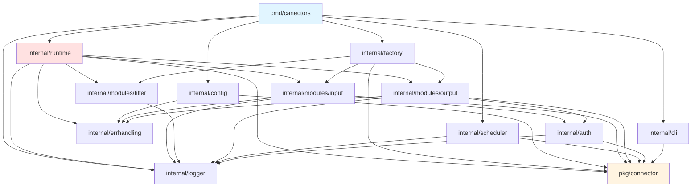

# ARCHITECTURE — Canectors Runtime

**Date**: 2026-01-23
**Public cible**: Ingénieur Java Senior (10+ ans) apprenant Go
**Niveau**: Vue macro système

---

## 1. Rôle Global de l'Application

**Canectors Runtime** est un **moteur d'exécution de pipelines ETL déclaratifs** écrit en Go.

### Mental Model (Perspective Java)

Si vous connaissez **Apache Beam**, **Spring Batch**, ou **Talend Open Studio**, Canectors Runtime est l'équivalent Go léger et sans framework.

**Analogie Spring Boot**:
```
Configuration YAML/JSON → Runtime parsing → Pipeline execution
  (comme application.yml → Spring context → Service orchestration)
```

**Différence majeure**:
- Pas de framework lourd
- Pas d'annotations
- Pas de classpath scanning
- Configuration déclarative pure → Exécution directe

---

## 2. Paradigme Architectural

### Pattern Principal: **Input → Transform → Output**

```
┌──────────────────────────────────────────────────────────┐
│                   PIPELINE EXECUTION                      │
├──────────────────────────────────────────────────────────┤
│                                                           │
│  INPUT MODULE          FILTER MODULES        OUTPUT      │
│  ┌───────────┐         ┌──────────┐         ┌─────────┐ │
│  │ HTTP Poll │   →     │ Mapping  │   →     │ HTTP    │ │
│  │ Webhook   │         │ Condition│         │ Request │ │
│  │ ...       │         │ ...      │         │ ...     │ │
│  └───────────┘         └──────────┘         └─────────┘ │
│       ↓                     ↓                    ↓       │
│  Fetch Data          Transform Data         Send Data   │
│                                                           │
└──────────────────────────────────────────────────────────┘
```

### Équivalent Java

| Canectors Concept | Équivalent Java Spring |
|-------------------|------------------------|
| **Pipeline** | `@Configuration` class avec beans orchestrés |
| **Input Module** | `@Component` qui fetche data (e.g., `RestTemplate.getForObject()`) |
| **Filter Module** | `@Service` qui transforme (e.g., `BeanMapper`, `Validator`) |
| **Output Module** | `@Component` qui envoie (e.g., `KafkaTemplate.send()`) |
| **Executor** | `@Service` orchestrateur (e.g., `ApplicationRunner`) |
| **Scheduler** | `@Scheduled` avec CRON expressions |

---

## 3. Découpage par Packages

### Vue d'ensemble

```
canectors-runtime/
├── cmd/canectors/          → CLI entry point (comme Spring Boot main class)
├── pkg/connector/          → API publique (types exportés)
└── internal/               → Implémentation privée
    ├── auth/               → Authentification HTTP
    ├── cli/                → Formatage sortie CLI
    ├── config/             → Parsing/validation configuration
    ├── errhandling/        → Classification erreurs + retry
    ├── factory/            → Factory pattern (création modules)
    ├── logger/             → Logging structuré (slog)
    ├── modules/
    │   ├── input/          → Implémentations input (HTTP polling, Webhook)
    │   ├── filter/         → Implémentations filter (Mapping, Condition)
    │   └── output/         → Implémentations output (HTTP request)
    ├── runtime/            → Orchestrateur pipeline (Executor)
    └── scheduler/          → Planificateur CRON
```

### Équivalent Java Maven

```java
// Équivalent Maven structure
com.canectors.runtime/
├── cli/                    // Main class
├── api/                    // Types publics (comme pkg/)
└── core/                   // Internal packages
    ├── auth/
    ├── config/
    ├── modules/
    │   ├── input/
    │   ├── filter/
    │   └── output/
    ├── runtime/            // Orchestration
    └── scheduler/
```

**Différence Go vs Java**:
- **`pkg/`** = API publique (équivalent `public class`)
- **`internal/`** = Code privé (équivalent `package-private`)
  - Restriction compilateur: impossible d'importer `internal/` depuis autre repo
  - Plus strict que `package-private` Java

---

## 4. Responsabilités Majeures

### Package `cmd/canectors` — Point d'entrée CLI

**Rôle**: Main class + CLI commands (équivalent Spring Boot `@SpringBootApplication`)

**Responsabilités**:
- Parse arguments CLI (Cobra framework)
- Charge configuration (JSON/YAML)
- Valide configuration
- Exécute pipeline ou scheduler
- Gère exit codes

**Équivalent Java**:
```java
@SpringBootApplication
public class CanectorsApplication {
    public static void main(String[] args) {
        // CLI parsing
        // Config loading
        // Pipeline execution
    }
}
```

---

### Package `pkg/connector` — API Publique

**Rôle**: Types DTO publics (équivalent DTOs/Models dans Spring)

**Types principaux**:
- `Pipeline`: Configuration pipeline complète
- `ModuleConfig`: Configuration module
- `ExecutionResult`: Résultat exécution
- `RetryInfo`: Info retry

**Équivalent Java**:
```java
// pkg/connector types.go
public class Pipeline {
    private String id;
    private String name;
    private ModuleConfig input;
    private List<ModuleConfig> filters;
    private ModuleConfig output;
    // getters/setters
}
```

**Différence Go**:
- Pas de getters/setters (accès direct champs publics)
- Pas d'héritage (composition pure)

---

### Package `internal/config` — Parsing & Validation

**Rôle**: ConfigurationProperties + Validator (équivalent Spring)

**Responsabilités**:
- Parse JSON/YAML → `map[string]interface{}`
- Valide contre schéma JSON
- Convertit `map` → struct `Pipeline`

**Équivalent Java Spring**:
```java
@ConfigurationProperties(prefix = "connector")
@Validated
public class ConnectorConfig {
    @NotNull
    private String name;
    @Valid
    private InputConfig input;
    // ...
}
```

**Différence Go**:
- Pas d'annotations
- Validation programmatique via schéma JSON externe
- Conversion manuelle `map` → struct

---

### Package `internal/runtime` — Orchestrateur Pipeline

**Rôle**: Service orchestrateur (équivalent Spring `@Service` orchestrateur)

**Type principal**: `Executor`

**Responsabilités**:
1. Reçoit Pipeline + Modules
2. Exécute Input.Fetch()
3. Pour chaque Filter: Filter.Process()
4. Exécute Output.Send()
5. Gère erreurs + retry
6. Log métriques

**Équivalent Java Spring**:
```java
@Service
public class PipelineExecutor {
    @Autowired
    private InputModule inputModule;

    @Autowired
    private List<FilterModule> filterModules;

    @Autowired
    private OutputModule outputModule;

    public ExecutionResult execute(Pipeline pipeline) {
        // 1. Fetch data
        List<Record> records = inputModule.fetch();

        // 2. Transform data
        for (FilterModule filter : filterModules) {
            records = filter.process(records);
        }

        // 3. Send data
        int sent = outputModule.send(records);

        return new ExecutionResult(sent, ...);
    }
}
```

**Différence Go**:
- Pas d'injection automatique (injection manuelle via constructeur)
- Interfaces minimales (1-2 méthodes)
- Pas de Spring container

---

### Package `internal/modules/*` — Implémentations Modules

**Rôle**: Components concrets (équivalent `@Component` Spring)

**Structure**:
```
modules/
├── input/
│   ├── input.go        → Interface Module
│   ├── http_polling.go → Impl HTTP polling
│   ├── webhook.go      → Impl Webhook
│   └── stub.go         → Stub (types non implémentés)
├── filter/
│   ├── filter.go       → Interface Module
│   ├── mapping.go      → Impl Mapping
│   ├── condition.go    → Impl Condition
│   └── stub.go
└── output/
    ├── output.go       → Interface Module + PreviewableModule
    ├── http_request.go → Impl HTTP request
    └── stub.go
```

**Interfaces**:
```go
// input.Module
type Module interface {
    Fetch(ctx context.Context) ([]map[string]interface{}, error)
    Close() error
}

// filter.Module
type Module interface {
    Process(ctx context.Context, records []map[string]interface{}) ([]map[string]interface{}, error)
}

// output.Module
type Module interface {
    Send(ctx context.Context, records []map[string]interface{}) (int, error)
    Close() error
}
```

**Équivalent Java**:
```java
// Input Module
public interface InputModule {
    List<Map<String, Object>> fetch() throws Exception;
    void close() throws Exception;
}

@Component
public class HttpPollingInput implements InputModule {
    public List<Map<String, Object>> fetch() { ... }
}

// Filter Module
public interface FilterModule {
    List<Map<String, Object>> process(List<Map<String, Object>> records);
}

@Component
public class MappingFilter implements FilterModule {
    public List<Map<String, Object>> process(...) { ... }
}

// Output Module
public interface OutputModule {
    int send(List<Map<String, Object>> records) throws Exception;
    void close() throws Exception;
}

@Component
public class HttpRequestOutput implements OutputModule {
    public int send(...) { ... }
}
```

**Différence Go**:
- Pas d'annotations `@Component`
- Création explicite via factory
- Interfaces plus petites (Go idiom: petites interfaces composables)

---

### Package `internal/factory` — Factory Pattern

**Rôle**: Factory beans (équivalent `@Bean` methods Spring)

**Responsabilités**:
- `CreateInputModule(config)` → input.Module
- `CreateFilterModules(configs)` → []filter.Module
- `CreateOutputModule(config)` → output.Module

**Équivalent Java Spring**:
```java
@Configuration
public class ModuleFactory {
    @Bean
    public InputModule createInputModule(ModuleConfig config) {
        switch (config.getType()) {
            case "httpPolling": return new HttpPollingInput(config);
            case "webhook": return new WebhookInput(config);
            default: return new StubInput(config);
        }
    }

    @Bean
    public List<FilterModule> createFilterModules(List<ModuleConfig> configs) {
        return configs.stream()
            .map(this::createFilterModule)
            .collect(Collectors.toList());
    }
}
```

**Différence Go**:
- Pas d'annotations
- Functions pures (pas de class)
- Return explicit (pas de Spring container)

---

### Package `internal/scheduler` — Planification CRON

**Rôle**: `@Scheduled` tasks (équivalent Spring Scheduler)

**Dépendance externe**: `github.com/robfig/cron/v3`

**Responsabilités**:
- Register pipelines avec CRON expressions
- Start/Stop scheduler
- Prevent overlap (si exécution précédente pas finie)
- Graceful shutdown

**Équivalent Java Spring**:
```java
@EnableScheduling
@Component
public class PipelineScheduler {
    @Scheduled(cron = "0 0 * * * *")
    public void executePipeline() {
        // Execute pipeline
    }
}
```

**Différence Go**:
- Pas d'annotations
- Programmation manuelle via `cron.Cron`
- Overlap prevention manuel (flag + mutex)

---

### Package `internal/auth` — Authentification HTTP

**Rôle**: Interceptors/Filters (équivalent Spring Security)

**Interface**:
```go
type Handler interface {
    ApplyAuth(ctx context.Context, req *http.Request) error
    Type() string
}
```

**Implémentations**:
- API Key (header ou query param)
- Bearer Token
- Basic Auth
- OAuth2 Client Credentials

**Équivalent Java Spring**:
```java
public interface AuthHandler {
    void applyAuth(HttpRequest request) throws AuthException;
    String getType();
}

@Component
public class BearerAuthHandler implements AuthHandler {
    public void applyAuth(HttpRequest request) {
        request.addHeader("Authorization", "Bearer " + token);
    }
}
```

---

### Package `internal/errhandling` — Gestion Erreurs

**Rôle**: Exception handling + Retry logic (équivalent Spring Retry)

**Responsabilités**:
- Classification erreurs (network, auth, validation, server, rate_limit)
- Détermination retryability (transient vs fatal)
- Configuration retry (max attempts, backoff, delays)
- Helpers: `IsRetryable()`, `IsFatal()`, `ClassifyError()`

**Équivalent Java Spring**:
```java
@EnableRetry
@Service
public class ErrorClassifier {
    public ErrorCategory classify(Exception e) {
        if (e instanceof SocketException) return NETWORK;
        if (e instanceof UnauthorizedException) return AUTHENTICATION;
        // ...
    }

    public boolean isRetryable(Exception e) {
        ErrorCategory cat = classify(e);
        return cat == NETWORK || cat == SERVER;
    }
}

@Retryable(maxAttempts = 3, backoff = @Backoff(delay = 1000))
public void sendData() { ... }
```

**Différence Go**:
- Pas d'exceptions (return error)
- Pas d'annotations `@Retryable`
- Retry manuel avec loop + backoff

---

### Package `internal/logger` — Logging

**Rôle**: SLF4J + Logback (équivalent Java)

**Dépendance**: `log/slog` (Go 1.21+ standard library)

**Responsabilités**:
- Logging structuré (JSON ou Human-readable)
- Helpers: `LogExecutionStart()`, `LogStageEnd()`, `LogMetrics()`
- Context-aware (pipeline ID, stage, module type)

**Équivalent Java**:
```java
import org.slf4j.Logger;
import org.slf4j.LoggerFactory;

@Slf4j
public class PipelineExecutor {
    private static final Logger log = LoggerFactory.getLogger(PipelineExecutor.class);

    public void execute(Pipeline pipeline) {
        log.info("Execution started",
            kv("pipelineId", pipeline.getId()),
            kv("stage", "input"));
        // ...
    }
}
```

**Différence Go**:
- `slog` natif (pas besoin SLF4J)
- Structured logging par défaut
- Format JSON ou console

---

## 5. Dépendances entre Packages

### Diagramme Mermaid



### Hiérarchie des Dépendances

**Niveau 1 - Fondations** (pas de dépendances internes):
- `pkg/connector` (types publics)

**Niveau 2 - Utilitaires**:
- `internal/logger` → dépend API
- `internal/errhandling` → dépend API
- `internal/auth` → dépend Logger, API

**Niveau 3 - Modules**:
- `internal/modules/input` → dépend Auth, ErrHandling, Logger, API
- `internal/modules/filter` → dépend Logger
- `internal/modules/output` → dépend Auth, ErrHandling, Logger, API

**Niveau 4 - Orchestration**:
- `internal/config` → dépend API, ErrHandling
- `internal/factory` → dépend Input, Filter, Output, API
- `internal/runtime` → dépend Input, Filter, Output, ErrHandling, Logger, API
- `internal/scheduler` → dépend API, Logger

**Niveau 5 - Présentation**:
- `internal/cli` → dépend API
- `cmd/canectors` → dépend TOUT (point d'entrée)

---

## 6. Analogies Java/Spring Explicites

| Concept Canectors | Équivalent Java/Spring | Notes |
|-------------------|------------------------|-------|
| **Pipeline struct** | `@Configuration` class | Configuration déclarative |
| **Executor.Execute()** | `ApplicationRunner.run()` | Point exécution principal |
| **Module interface** | `@Component` interface | Contrat fonctionnel |
| **Factory.CreateModule()** | `@Bean` method | Création instances |
| **Scheduler.Register()** | `@Scheduled(cron="...")` | Planification CRON |
| **context.Context** | `ExecutorService` + `Future` | Cancellation/timeout |
| **error return** | `throws Exception` | Gestion erreurs |
| **struct** | `public class` (fields only) | Pas de méthodes dans struct (séparation data/behavior) |
| **interface** | `interface` (small) | Interfaces Go: 1-3 méthodes max (idiom) |
| **package visibility** | `public`/`package-private` | Exported (majuscule) vs non-exported |
| **`sync.Mutex`** | `synchronized` | Thread safety |
| **`sync.WaitGroup`** | `CountDownLatch` | Synchronization primitives |
| **`go func()` goroutine** | `new Thread()` ou `@Async` | Concurrency |
| **`make(map)` / `make([]T)` | `new HashMap<>()` / `new ArrayList<>()` | Collections init |

---

## 7. Invariants Architecturaux

### Règle 1: Pipeline = Immutable après parsing

**Règle**: Une fois `Pipeline` créée via `config.ConvertToPipeline()`, elle ne doit JAMAIS être mutée.

**Équivalent Java**: `@Immutable` class ou `final` fields

**Raison**: Configuration = contrat fixe. Modifications → comportement imprévisible.

---

### Règle 2: Modules = Indépendants

**Règle**: Modules ne doivent PAS se connaître entre eux. Communication via Executor uniquement.

**Pattern**: Dependency Inversion Principle (SOLID)

**Équivalent Java**:
```java
// WRONG
public class MappingFilter {
    @Autowired
    private HttpRequestOutput output;  // ❌ Couplage direct
}

// CORRECT
public class PipelineExecutor {
    @Autowired
    private FilterModule filter;       // ✅ Interfaces
    @Autowired
    private OutputModule output;       // ✅ Interfaces
}
```

---

### Règle 3: Error Classification = Exhaustive

**Règle**: Toute erreur doit être classifiée (network/auth/validation/server/rate_limit/not_found/unknown).

**Raison**: Retry logic dépend classification. Erreur non classifiée = comportement undefined.

**Équivalent Java**: Exception hierarchy bien définie

---

### Règle 4: Context Propagation = Obligatoire

**Règle**: Toutes méthodes async doivent accepter `context.Context` en premier paramètre.

**Signature Go**:
```go
func Fetch(ctx context.Context) ([]Record, error)
```

**Équivalent Java**:
```java
CompletableFuture<List<Record>> fetch(ExecutorService executor)
```

**Raison**: Permet cancellation, timeout, tracing distribué.

---

## 8. Design Decisions

### Décision 1: Pas de reflection pour création modules

**Choix**: Factory pattern explicite (switch/case sur type)

**Alternative rejetée**: Reflection (équivalent `Class.forName()`)

**Raison**:
- Performance: switch/case = fast path
- Type safety: erreurs compile-time vs runtime
- Simplicité: code lisible, pas de magic

---

### Décision 2: `map[string]interface{}` pour records

**Choix**: Records = map générique (schemaless)

**Alternative rejetée**: Struct typée par domaine

**Raison**:
- Flexibilité: support tout format JSON
- Évolutivité: pas besoin recompiler pour nouveau schema
- Pipeline-agnostic: même runtime pour différents domaines

**Trade-off**: Perte type safety (équivalent `Map<String, Object>` Java)

---

### Décision 3: Stub modules pour types non implémentés

**Choix**: Factory retourne Stub au lieu d'erreur

**Raison**:
- Évolutivité: permet config valide même si impl manquante
- Testing: stub = mock implicite
- Fail gracefully: erreur claire "not implemented" au runtime

---

### Décision 4: Scheduler in-process (pas distribué)

**Choix**: 1 scheduler par instance runtime (pas de coordination distribuée)

**Alternative rejetée**: Distributed scheduler (Quartz, K8s CronJob)

**Raison**:
- Simplicité: single-node suffit pour MVP
- Pas de dépendances externes (Redis, ZooKeeper)

**Limitation**: Pas de HA, pas de load balancing

---

## 9. Points d'Extension

### Extension 1: Nouveaux types modules

**Comment ajouter Input/Filter/Output custom**:

1. Créer fichier `internal/modules/{input|filter|output}/my_module.go`
2. Implémenter interface `Module`
3. Ajouter case dans `factory/modules.go`

**Exemple**:
```go
// 1. Créer impl
type MyCustomInput struct {
    config map[string]interface{}
}

func (m *MyCustomInput) Fetch(ctx context.Context) ([]map[string]interface{}, error) {
    // Impl custom
}

// 2. Register dans factory
func CreateInputModule(cfg *connector.ModuleConfig) input.Module {
    switch cfg.Type {
    case "myCustom":
        return NewMyCustomInput(cfg)
    // ...
    }
}
```

---

### Extension 2: Nouveaux auth handlers

**Comment ajouter Auth custom**:

1. Créer impl de `auth.Handler` dans `internal/auth/`
2. Register dans `auth.NewHandler()`

---

### Extension 3: Nouvelles transformations Mapping

**Comment ajouter transform custom**:

Modifier `internal/modules/filter/mapping.go` → fonction `applyTransforms()`

---

## 10. Limites Architecturales

### Limite 1: Single-threaded pipeline execution

**État actuel**: Pipeline exécute modules séquentiellement (Input → Filters → Output)

**Pas de parallélisation** des filters ou records.

**Équivalent Java**: Sequential stream (pas parallel stream)

**Raison**: Simplicité, order preservation

---

### Limite 2: In-memory processing

**État actuel**: Tous records chargés en mémoire

**Pas de streaming** (pas de support datasets > RAM)

**Trade-off**: Performance vs scalability

---

### Limite 3: Stateless modules

**État actuel**: Modules ne conservent PAS d'état entre exécutions

**Exemple**: HTTP polling ne stocke pas dernier timestamp fetchs (pas de cursor persistence)

**Limitation**: Pas de resume après crash

---

### Limite 4: No distributed coordination

**État actuel**: Scheduler local (1 instance = 1 scheduler)

**Pas de lock distribué**, pas de leader election

**Limitation**: Pas de HA scheduling

---

## 11. Comparaison avec Frameworks Java

| Aspect | Canectors Runtime | Spring Batch | Apache Beam |
|--------|-------------------|--------------|-------------|
| **Langage** | Go | Java | Java/Python/Go |
| **Configuration** | JSON/YAML déclaratif | Java code + annotations | Java code (Pipeline API) |
| **Orchestration** | Custom Executor | Spring TaskExecutor | Runner (Flink/Spark/Dataflow) |
| **Scheduling** | robfig/cron CRON | Spring `@Scheduled` | External (Airflow, etc.) |
| **Parallelism** | Sequential | Multi-threaded (chunks) | Distributed parallel |
| **State** | Stateless | Job repository (DB) | Stateful transforms |
| **Retry** | Custom backoff | Spring Retry | Runner-specific |
| **Scalability** | Single-node | Multi-threaded | Distributed cluster |
| **Footprint** | ~30k LOC, <50MB binary | Framework lourd | Cluster infrastructure |
| **Use case** | ETL léger, webhooks, API sync | Batch processing | Big Data pipelines |

---

## 12. Conclusion — Mental Model Final

**Canectors Runtime** = **Micro-ETL orchestrator** en Go, optimisé pour:

1. **Légèreté**: Pas de framework, dépendances minimales
2. **Déclaratif**: Config → Exécution (pas de code)
3. **Extensibilité**: Interfaces simples, factory pattern
4. **Fiabilité**: Retry + error classification
5. **Observabilité**: Logging structuré, métriques

**Analogie finale pour Java dev**:

> "C'est comme **Spring Batch** simplifié, sans framework lourd, avec configuration déclarative type **application.yml**, et exécution single-node type **@Scheduled** tasks. Pensez **orchestrateur léger** plutôt que **plateforme Big Data**."

---

**Fichier suivant**: `EXECUTION_FLOW.md`
