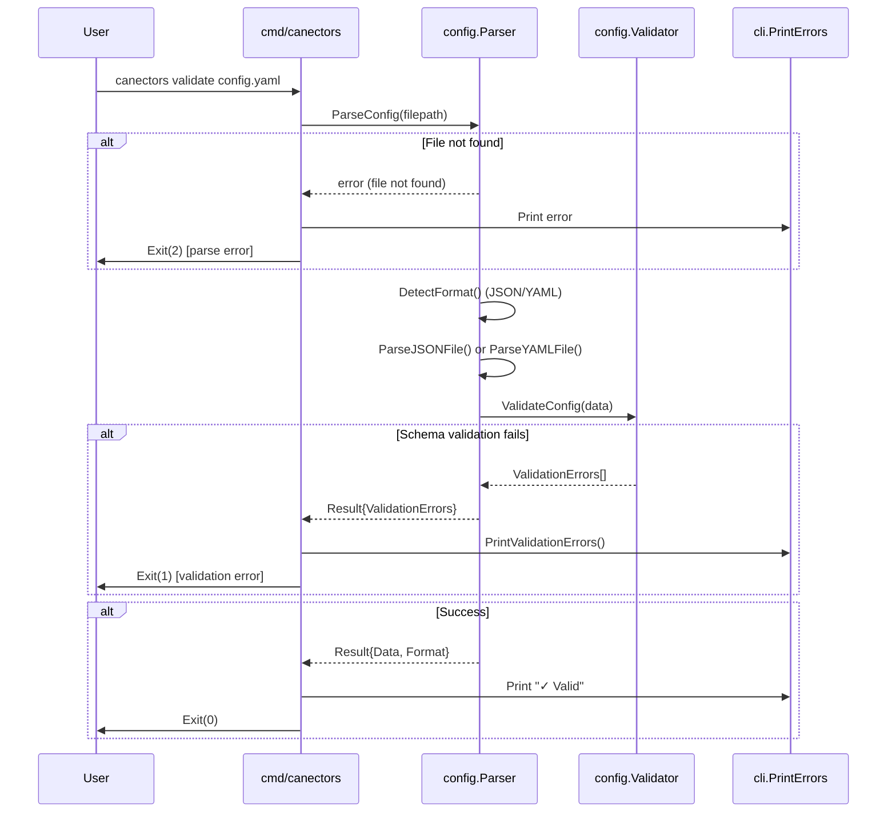
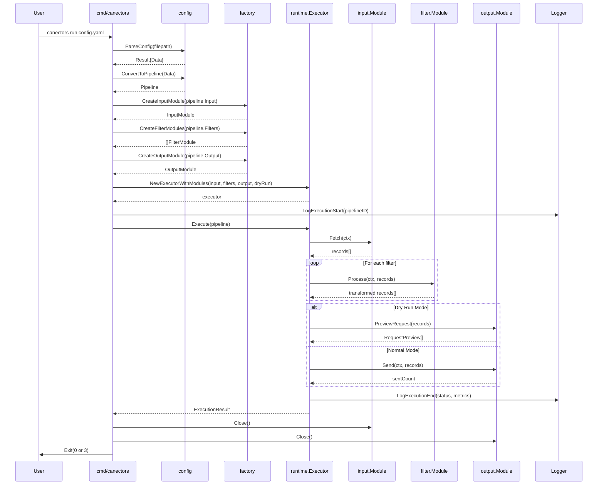
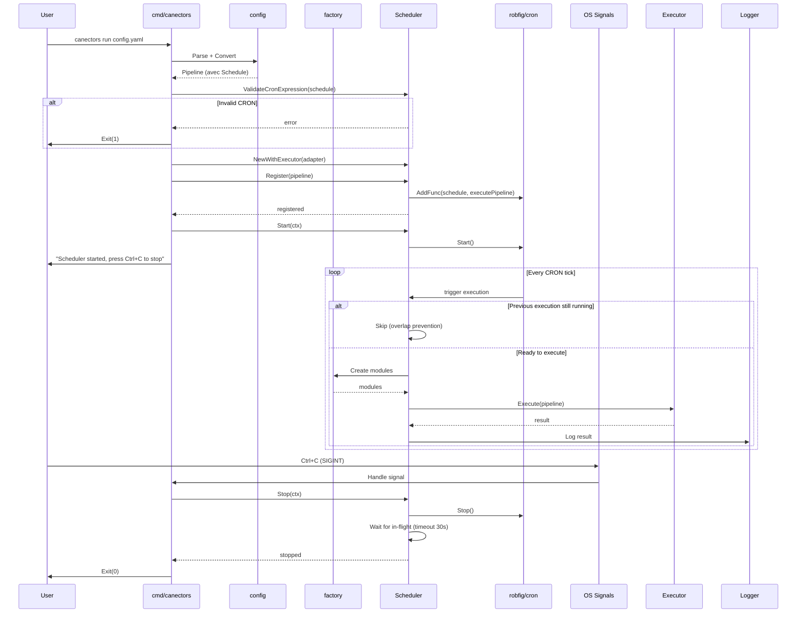

# EXECUTION FLOW — Canectors Runtime

**Date**: 2026-01-23
**Public cible**: Ingénieur Java Senior (10+ ans) apprenant Go
**Niveau**: Flux d'exécution détaillé

---

## 1. Vue d'Ensemble — Qu'est-ce qui se passe quand le programme tourne?

### Mental Model Java

Imaginez une application Spring Boot avec:
- `main()` → parse args CLI → charge config → exécute service
- Scheduling optionnel via `@Scheduled`
- Gestion graceful shutdown

**Canectors fait exactement ça**, mais:
- Sans Spring container
- CLI via Cobra (équivalent Picocli/JCommander)
- Configuration déclarative JSON/YAML → Pipeline exécution

---

## 2. Points d'Entrée

### 2.1 Entry Point Principal

**Fichier**: `cmd/canectors/main.go`

```
func main() {
    if err := rootCmd.Execute(); err != nil {
        os.Exit(ExitRuntimeError)
    }
}
```

**Équivalent Java**:
```java
public class CanectorsApplication {
    public static void main(String[] args) {
        int exitCode = new CommandLine(new CanectorsCommand()).execute(args);
        System.exit(exitCode);
    }
}
```

---

### 2.2 Commandes CLI Disponibles

| Commande | Description | Exit Codes |
|----------|-------------|------------|
| `validate <config-file>` | Parse + validate config | 0=valid, 1=validation error, 2=parse error |
| `run <config-file>` | Exécute pipeline | 0=success, 1=validation, 2=parse, 3=runtime |
| `version` | Affiche version | 0=always |

**Flags globaux**:
- `--verbose, -v`: Log level DEBUG + format human-readable
- `--quiet, -q`: Log level ERROR seulement
- `--log-file <path>`: Écrit logs dans fichier (JSON format)

---

## 3. Flow Exécution — Command `validate`

### Diagramme Sequence



---

### Étapes Détaillées

#### Étape 1: Parse filepath argument

```
CLI parsing: cobra.Command.Args validation
→ Vérifie 1 argument fourni
→ Extrait filepath
```

#### Étape 2: Parse config file

**Fonction**: `config.ParseConfig(filepath)`

**Sous-étapes**:
1. `DetectFormat(filepath)` → "json" ou "yaml"
2. Selon format:
   - JSON: `ParseJSONFile()` → `json.Unmarshal()`
   - YAML: `ParseYAMLFile()` → `yaml.Unmarshal()`
3. Retourne `map[string]interface{}`

**Erreurs possibles**:
- Fichier introuvable → ParseError
- Syntaxe invalide → ParseError (invalid JSON/YAML)

#### Étape 3: Validate schema

**Fonction**: `config.ValidateConfig(data)`

**Sous-étapes**:
1. Lazy load schéma JSON (via `sync.Once`)
2. Compile schéma (cache permanent)
3. Validate `data` contre schéma
4. Convertit `jsonschema.ValidationError` → `config.ValidationError`

**Validation checks**:
- `schemaVersion` présent et format `X.Y.Z`
- `connector.name` présent et pattern `[a-z][a-z0-9_-]*`
- `connector.input.type` présent
- `connector.filters` array valide
- `connector.output.type` présent
- Si type="httpPolling" → `endpoint` + `schedule` required
- Si type="httpRequest" → `endpoint` + `method` required
- etc.

#### Étape 4: Print results

**Succès**:
```
✓ Configuration is valid
  Format: yaml
  Schema version: 1.1.0
```

**Validation errors**:
```
✗ Configuration validation failed

Error 1: /connector/input/endpoint
  Missing required field 'endpoint'

Error 2: /connector/output/method
  Invalid value 'DELETE' (must be POST, PUT, or PATCH)
```

**Exit codes**:
- 0: Config valide
- 1: Erreurs validation schema
- 2: Erreurs parsing (fichier illisible, JSON/YAML invalide)

---

## 4. Flow Exécution — Command `run` (Mode One-Shot)

### Diagramme Sequence Complet



---

### Étapes Détaillées

#### Phase 1: Configuration (Parse + Convert)

**Étape 1.1**: Parse + Validate (identique command `validate`)

**Étape 1.2**: Convert `map[string]interface{}` → `connector.Pipeline`

**Fonction**: `config.ConvertToPipeline(data)`

**Sous-étapes**:
1. Extract connector section: `data["connector"]`
2. Extract metadata:
   - `pipeline.ID = connector["id"]`
   - `pipeline.Name = connector["name"]`
   - `pipeline.Version = connector["version"]`
   - `pipeline.Enabled = connector["enabled"]` (default true)
   - `pipeline.Schedule = connector["schedule"]` (optionnel)
3. Extract defaults:
   - `connector["defaults"]` → `ModuleDefaults`
   - Fallback to legacy `connector["errorHandling"]` si absent
4. Extract modules:
   - `connector["input"]` → `ModuleConfig`
   - `connector["filters"][]` → `[]ModuleConfig`
   - `connector["output"]` → `ModuleConfig`
5. Apply error handling inheritance:
   - Module.OnError || Defaults.OnError || "fail"
   - Module.TimeoutMs || Defaults.TimeoutMs || 30000
   - Module.Retry || Defaults.Retry || DefaultRetryConfig

**Résultat**: `Pipeline` struct complète

---

#### Phase 2: Module Creation (Factory Pattern)

**Étape 2.1**: Create Input Module

**Fonction**: `factory.CreateInputModule(pipeline.Input)`

**Logic**:
```
switch pipeline.Input.Type {
case "httpPolling":
    return NewHTTPPollingInput(pipeline.Input)
case "webhook":
    return NewWebhookInput(pipeline.Input)
default:
    return NewStubInput(pipeline.Input.Type)
}
```

**Note**: Stub retourne erreur "not implemented" lors de Fetch()

---

**Étape 2.2**: Create Filter Modules

**Fonction**: `factory.CreateFilterModules(pipeline.Filters)`

**Logic**: Pour chaque filter config:
```
switch filterConfig.Type {
case "mapping":
    mappings = ParseFieldMappings(config["mappings"])
    return NewMappingFromConfig(mappings, onError)
case "condition":
    condConfig = ParseConditionConfig(config)
    return NewConditionFromConfig(condConfig)
default:
    return NewStubFilter(filterConfig.Type, index)
}
```

**Résultat**: `[]filter.Module` (peut être vide)

---

**Étape 2.3**: Create Output Module

**Fonction**: `factory.CreateOutputModule(pipeline.Output)`

**Logic**:
```
switch pipeline.Output.Type {
case "httpRequest":
    return NewHTTPRequestFromConfig(pipeline.Output)
default:
    return NewStubOutput(pipeline.Output.Type)
}
```

---

#### Phase 3: Executor Creation

**Fonction**: `runtime.NewExecutorWithModules(input, filters, output, dryRun)`

**Équivalent Java**:
```java
public PipelineExecutor(
    InputModule input,
    List<FilterModule> filters,
    OutputModule output,
    boolean dryRun
) {
    this.input = input;
    this.filters = filters;
    this.output = output;
    this.dryRun = dryRun;
}
```

**Propriétés**:
- Executor conserve références modules
- Aucune logique métier dans constructeur (injection pure)

---

#### Phase 4: Pipeline Execution

**Fonction**: `executor.Execute(pipeline)`

**Équivalent**: `executor.ExecuteWithContext(context.Background(), pipeline)`

**Sous-phases**:

##### Phase 4.1: Validation Pre-Execution

```
Checks:
- pipeline != nil
- inputModule != nil
- outputModule != nil (sauf si dryRun=true)

Si fail → Return ExecutionResult{Status: "error", Error: ...}
```

---

##### Phase 4.2: Setup Cleanup (Defer)

**Pattern Go**: defer pour cleanup garanti

```go
defer inputModule.Close()
defer outputModule.Close()
```

**Équivalent Java**:
```java
try (InputModule input = createInput();
     OutputModule output = createOutput()) {
    // Execution logic
} // Auto-close
```

---

##### Phase 4.3: Execute Input Module

**Fonction**: `inputModule.Fetch(ctx)`

**Exemple HTTP Polling**:
1. Build HTTP request: `http.NewRequestWithContext(ctx, "GET", endpoint, nil)`
2. Apply authentication: `authHandler.ApplyAuth(ctx, req)`
3. Execute request: `client.Do(req)` avec retry
4. Parse response body: `json.Unmarshal(body, &data)`
5. Extract records:
   - Si `dataField` configuré → extract nested field
   - Sinon → root object
6. Handle pagination (si configuré):
   - Page-based: increment page number
   - Offset-based: increment offset
   - Cursor-based: extract next cursor
7. Retourne `[]map[string]interface{}`

**Erreurs possibles**:
- Network error → classified as NETWORK → retryable
- Auth error (401) → classified as AUTHENTICATION → fatal
- Server error (5xx) → classified as SERVER → retryable
- Parse error → classified as VALIDATION → fatal

---

##### Phase 4.4: Execute Filter Modules (Sequential)

**Loop**: Pour chaque filter dans ordre config

**Fonction**: `filterModule.Process(ctx, records)`

**Exemple Mapping Filter**:
1. Pour chaque record dans records:
   - Pour chaque mapping dans config:
     - Extract source value: `getFieldValue(record, mapping.Source)`
     - Apply default si missing: selon `mapping.OnMissing`
     - Apply transforms: chain de transformations
     - Set target value: `setFieldValue(record, mapping.Target, value)`
2. Handle onError:
   - "fail" → return error immédiatement
   - "skip" → skip record, continue
   - "log" → log error, continue
3. Retourne transformed records

**Exemple Condition Filter**:
1. Compile expression (cache): `expr.Compile(expression)`
2. Pour chaque record:
   - Evaluate expression: `expr.Run(program, record)` → bool
   - Si true: apply `onTrue` behavior (continue/skip)
   - Si false: apply `onFalse` behavior (continue/skip)
   - Si error: apply `onError` behavior (fail/skip/log)
3. Retourne filtered records

**Résultat**: `[]map[string]interface{}` (peut être subset original)

---

##### Phase 4.5: Dry-Run Preview (Optionnel)

**Si `--dry-run` flag activé**:

**Fonction**: `outputModule.PreviewRequest(records, opts)`

**Logic** (HTTPRequestModule):
1. Détermine mode: batch (tous records en 1 requête) ou single (1 requête par record)
2. Pour chaque requête virtuelle:
   - Resolve endpoint (avec path params si configuré)
   - Build headers (mask auth headers par défaut)
   - Format body: `json.MarshalIndent(records, "", "  ")`
3. Retourne `[]RequestPreview`:
   ```
   [{
       Endpoint: "https://api.example.com/webhook",
       Method: "POST",
       Headers: {
           "Authorization": "[MASKED-TOKEN]",
           "Content-Type": "application/json"
       },
       BodyPreview: "{\n  \"id\": 1,\n  ...\n}",
       RecordCount: 5
   }]
   ```

**Output**: Preview affiché dans console (pas d'envoi réel)

---

##### Phase 4.6: Execute Output Module

**Si mode normal (pas dry-run)**:

**Fonction**: `outputModule.Send(ctx, records)`

**Exemple HTTP Request Output**:

**Mode Batch** (bodyFrom="records"):
1. Marshal tous records: `json.Marshal(records)` → body JSON array
2. Build HTTP request: `http.NewRequestWithContext(ctx, method, endpoint, body)`
3. Set headers: Content-Type, Authorization, custom headers
4. Apply authentication: `authHandler.ApplyAuth(ctx, req)`
5. Execute avec retry:
   - Loop jusqu'à maxAttempts
   - Calculate backoff delay: `min(delay * (multiplier ^ attempt), maxDelay)`
   - Sleep delay si retry
   - Execute: `client.Do(req)`
   - Si success (status 2xx) → break
   - Si error:
     - Classify error: `ClassifyHTTPStatus(statusCode)`
     - Si retryable (429, 5xx) → continue loop
     - Si fatal (4xx sauf 429) → return error
6. Retourne sent count (len(records) si success)

**Mode Single** (bodyFrom="record"):
1. Pour chaque record individuellement:
   - Marshal record: `json.Marshal(record)`
   - Resolve endpoint (avec path params depuis record)
   - Build request
   - Execute avec retry (identique batch)
   - Handle onError per-record:
     - "fail" → stop et return error
     - "skip" → log error, continue next record
     - "log" → log error, continue
2. Retourne sent count (nb records envoyés avec succès)

**Erreurs possibles**:
- Network error → retry avec backoff
- Auth error → fail immediately (ou invalidate token si OAuth2)
- Rate limit (429) → retry avec backoff
- Server error (5xx) → retry
- Client error (4xx) → fail (pas retry)

---

##### Phase 4.7: Log Metrics

**Fonction**: `logger.LogExecutionEnd(ctx, status, recordsProcessed, totalDuration)`

**Métriques loggées**:
```json
{
    "level": "info",
    "msg": "pipeline execution completed",
    "pipeline_id": "my-pipeline",
    "status": "success",
    "records_processed": 100,
    "records_failed": 0,
    "total_duration_ms": 1234,
    "input_duration_ms": 500,
    "filter_duration_ms": 200,
    "output_duration_ms": 534,
    "records_per_second": 81.03,
    "avg_record_time_ms": 12.34
}
```

---

##### Phase 4.8: Return ExecutionResult

**Fonction**: Return `ExecutionResult` struct

**Contenu**:
```go
type ExecutionResult struct {
    PipelineID       string
    Status           string  // "success" ou "error"
    RecordsProcessed int
    RecordsFailed    int
    StartedAt        time.Time
    CompletedAt      time.Time
    Error            *ExecutionError
    RetryInfo        *RetryInfo
    DryRunPreview    []RequestPreview
}
```

---

#### Phase 5: Cleanup & Exit

**Étape 5.1**: Close modules (via defer)

```
inputModule.Close()  // Close HTTP connections
outputModule.Close() // Close HTTP connections
```

**Étape 5.2**: Print result summary

**Succès**:
```
✓ Pipeline executed successfully
  Pipeline: my-pipeline
  Records processed: 100
  Records failed: 0
  Duration: 1.234s
```

**Erreur**:
```
✗ Pipeline execution failed
  Pipeline: my-pipeline
  Module: output
  Error: HTTP request failed: 500 Internal Server Error
  Records processed: 0
  Records failed: 100
```

**Étape 5.3**: Exit avec code approprié

```
Exit Codes:
- 0: Success
- 1: Validation error (never reached si config valide)
- 2: Parse error (never reached si config parsable)
- 3: Runtime error (erreur durant exécution)
```

---

## 5. Flow Exécution — Command `run` (Mode Scheduled)

### Condition Activation

**Si `pipeline.Schedule != ""` (CRON expression présente)**:

→ Mode scheduled activé au lieu de one-shot

---

### Diagramme Sequence Scheduled



---

### Étapes Détaillées Mode Scheduled

#### Étape 1: Validate CRON Expression

**Fonction**: `scheduler.ValidateCronExpression(pipeline.Schedule)`

**Logic**:
1. Parse CRON expression via `cron.Parser`
2. Formats supportés:
   - 5-field: `minute hour day month weekday` (exemple: `0 * * * *`)
   - 6-field: `second minute hour day month weekday` (exemple: `0 0 * * * *`)
3. Si invalid → return error

**Exemples valides**:
- `"0 * * * *"` → Every hour at minute 0
- `"*/5 * * * *"` → Every 5 minutes
- `"0 0 * * * *"` → Every hour at second 0
- `"@hourly"` → Every hour (descriptor)
- `"@daily"` → Every day at midnight

---

#### Étape 2: Create Scheduler

**Fonction**: `scheduler.NewWithExecutor(adapter)`

**Adapter Pattern**:
```go
// Adapter pour convertir runtime.Executor → scheduler.Executor
type PipelineExecutorAdapter struct {
    inputModule   input.Module
    filterModules []filter.Module
    outputModule  output.Module
    dryRun        bool
}

func (a *PipelineExecutorAdapter) Execute(pipeline *Pipeline) (*ExecutionResult, error) {
    executor := runtime.NewExecutorWithModules(a.inputModule, a.filterModules, a.outputModule, a.dryRun)
    return executor.Execute(pipeline)
}
```

**Équivalent Java**:
```java
// Adapter pattern
public class PipelineExecutorAdapter implements ScheduledExecutor {
    private final InputModule input;
    private final List<FilterModule> filters;
    private final OutputModule output;

    @Override
    public ExecutionResult execute(Pipeline pipeline) {
        PipelineExecutor executor = new PipelineExecutor(input, filters, output);
        return executor.execute(pipeline);
    }
}
```

---

#### Étape 3: Register Pipeline

**Fonction**: `scheduler.Register(pipeline)`

**Logic**:
1. Validate pipeline != nil
2. Validate pipeline.Enabled == true
3. Validate pipeline.Schedule != ""
4. Validate CRON expression
5. Create CRON entry:
   ```go
   entryID, err := cron.AddFunc(schedule, func() {
       executePipeline(reg)
   })
   ```
6. Store dans map: `pipelines[pipelineID] = registeredPipeline{pipeline, entryID, running: false}`

**Erreurs possibles**:
- Pipeline nil → ErrNilPipeline
- Pipeline disabled → ErrPipelineDisabled
- Schedule vide → ErrEmptySchedule
- CRON invalid → ErrInvalidCronExpression

---

#### Étape 4: Start Scheduler

**Fonction**: `scheduler.Start(ctx)`

**Logic**:
1. Check si déjà started → error si oui
2. Set flag `started = true`
3. Store context + cancel function (pour graceful shutdown)
4. Start underlying CRON: `cron.Start()`
5. Return (non-blocking)

**Équivalent Java**:
```java
@Component
public class PipelineScheduler {
    private ScheduledExecutorService executor;

    public void start() {
        if (started) throw new IllegalStateException("Already started");
        started = true;
        executor = Executors.newScheduledThreadPool(1);
        // Register scheduled tasks
    }
}
```

---

#### Étape 5: CRON Execution Loop

**À chaque tick CRON**:

**Fonction**: `executePipeline(reg *registeredPipeline)`

**Logic**:
1. Acquire lock: `reg.mu.Lock()`
2. Check overlap:
   ```go
   if reg.running {
       log.Warn("previous execution still running, skipping")
       return
   }
   reg.running = true
   ```
3. Release lock: `reg.mu.Unlock()`
4. Launch goroutine:
   ```go
   wg.Add(1)
   go func() {
       defer wg.Done()
       defer func() {
           reg.mu.Lock()
           reg.running = false
           reg.mu.Unlock()
       }()

       // Execute pipeline
       result, err := executor.Execute(pipeline)
       // Log result
   }()
   ```

**Équivalent Java**:
```java
@Scheduled(cron = "${pipeline.schedule}")
public void executePipeline() {
    synchronized (lock) {
        if (running) {
            log.warn("Previous execution still running, skipping");
            return;
        }
        running = true;
    }

    try {
        ExecutionResult result = executor.execute(pipeline);
        logResult(result);
    } finally {
        synchronized (lock) {
            running = false;
        }
    }
}
```

---

#### Étape 6: Graceful Shutdown (Signal Handling)

**Signal**: User presse `Ctrl+C` (SIGINT) ou `kill <pid>` (SIGTERM)

**Handler**:
```go
signals := make(chan os.Signal, 1)
signal.Notify(signals, syscall.SIGINT, syscall.SIGTERM)

<-signals  // Block jusqu'à signal reçu

// Graceful shutdown
ctx, cancel := context.WithTimeout(context.Background(), 30*time.Second)
defer cancel()

scheduler.Stop(ctx)
```

**Fonction**: `scheduler.Stop(ctx)`

**Logic**:
1. Stop CRON (pas de nouvelles exécutions): `cron.Stop()`
2. Wait for in-flight executions:
   ```go
   done := make(chan struct{})
   go func() {
       wg.Wait()      // Wait all goroutines finish
       close(done)
   }()

   select {
   case <-done:
       log.Info("all executions completed")
   case <-ctx.Done():
       log.Warn("shutdown timeout, forcefully stopping")
   }
   ```
3. Récupère tous pipelines registered
4. Return

**Équivalent Java**:
```java
@PreDestroy
public void shutdown() {
    executor.shutdown();
    try {
        if (!executor.awaitTermination(30, TimeUnit.SECONDS)) {
            log.warn("Shutdown timeout, forcing");
            executor.shutdownNow();
        }
    } catch (InterruptedException e) {
        executor.shutdownNow();
    }
}
```

---

## 6. Gestion Erreurs — Stratégie Globale

### 6.1 Classification Erreurs

**Fonction**: `errhandling.ClassifyError(err)`

**Catégories**:

| Category | Description | Retryable | Exemples |
|----------|-------------|-----------|----------|
| `network` | Erreur réseau | ✅ Yes | Connection refused, timeout |
| `authentication` | Erreur auth | ❌ No | 401 Unauthorized |
| `validation` | Erreur validation | ❌ No | Invalid JSON, missing field |
| `rate_limit` | Rate limiting | ✅ Yes | 429 Too Many Requests |
| `server` | Erreur serveur | ✅ Yes | 500, 502, 503, 504 |
| `not_found` | Ressource introuvable | ❌ No | 404 Not Found |
| `unknown` | Erreur inconnue | ❌ No | Cas par défaut |

---

### 6.2 Retry Logic

**Fonction**: `shouldRetry(err, config)`

**Decision Tree**:
```
1. Classify error → Category
2. Si category = fatal (auth, validation, not_found) → NO RETRY
3. Si category = retryable (network, server, rate_limit):
   - Si HTTP status code:
     - Si code in config.RetryableStatusCodes → YES RETRY
     - Sinon → NO RETRY
   - Si network error → YES RETRY
4. Si attempt < maxAttempts → RETRY avec backoff
5. Sinon → FAIL définitif
```

**Backoff Calculation**:
```
delay = min(
    initialDelay * (backoffMultiplier ^ attempt),
    maxDelay
)

Exemple:
- Attempt 1: min(1000 * (2^0), 30000) = 1000ms
- Attempt 2: min(1000 * (2^1), 30000) = 2000ms
- Attempt 3: min(1000 * (2^2), 30000) = 4000ms
- Attempt 4: min(1000 * (2^3), 30000) = 8000ms
- Attempt 5: min(1000 * (2^4), 30000) = 16000ms
- Attempt 6: min(1000 * (2^5), 30000) = 30000ms (capped)
```

---

### 6.3 OnError Strategies

**Par module**: Config `onError` field

| Strategy | Comportement | Use Case |
|----------|--------------|----------|
| `fail` | Stop immédiatement sur première erreur | Production (data integrity critique) |
| `skip` | Skip record en erreur, continue avec suivants | Best-effort processing |
| `log` | Log erreur, continue (comme skip) | Debug, monitoring |

**Équivalent Java**:
```java
public enum OnErrorStrategy {
    FAIL,    // Throw exception
    SKIP,    // Log + continue
    LOG      // Log + continue (same as SKIP)
}
```

---

## 7. Context Propagation — Cancellation & Timeout

### 7.1 Context Usage

**Pattern Go**: `context.Context` passé en premier paramètre toute méthode async

**Signatures**:
```go
func Fetch(ctx context.Context) ([]Record, error)
func Process(ctx context.Context, records []Record) ([]Record, error)
func Send(ctx context.Context, records []Record) (int, error)
```

**Équivalent Java**:
```java
// Java: pas de context natif, mais pattern similaire
CompletableFuture<List<Record>> fetch(ExecutorService executor);
// Ou avec timeout
List<Record> fetch(Duration timeout) throws TimeoutException;
```

---

### 7.2 Cancellation Propagation

**Exemple**: User presse Ctrl+C durant exécution

```
1. Signal handler receive SIGINT
2. Call context.cancel()
3. Context propagate cancellation:
   - ctx.Done() channel closed
   - All blocking operations receive cancellation
4. HTTP requests abort: http.NewRequestWithContext(ctx, ...)
5. Goroutines check ctx.Done() et exit gracefully
```

**Code Pattern**:
```go
select {
case <-ctx.Done():
    return ctx.Err()  // context.Canceled ou context.DeadlineExceeded
case result := <-responseChan:
    return result
}
```

---

### 7.3 Timeout Enforcement

**Deux niveaux**:

1. **Global timeout** (pipeline niveau):
   ```go
   ctx, cancel := context.WithTimeout(context.Background(), 5*time.Minute)
   defer cancel()
   executor.ExecuteWithContext(ctx, pipeline)
   ```

2. **Module timeout** (HTTP client niveau):
   ```go
   client := &http.Client{
       Timeout: 30 * time.Second,
   }
   ```

**Priority**: Context timeout > HTTP client timeout

---

## 8. Dry-Run Mode — Validation Sans Side Effects

### Activation

**Flag CLI**: `canectors run config.yaml --dry-run`

---

### Comportement

**Input Module**: Exécuté normalement (fetch data)

**Filter Modules**: Exécutés normalement (transform data)

**Output Module**:
- **Skip**: `Send()` pas appelé
- **Preview**: `PreviewRequest()` appelé si module implements `PreviewableModule`

---

### Preview Generation

**Fonction**: `outputModule.PreviewRequest(records, opts)`

**Options**:
- `ShowCredentials`: bool (default false)
  - false: Mask auth headers (`Authorization: [MASKED-TOKEN]`)
  - true: Show real auth values (⚠️ debug only)

**Output**:
```json
[
  {
    "endpoint": "https://api.example.com/webhook",
    "method": "POST",
    "headers": {
      "Authorization": "[MASKED-BEARER]",
      "Content-Type": "application/json",
      "X-Custom-Header": "value"
    },
    "bodyPreview": "{\n  \"records\": [\n    {\n      \"id\": 1,\n      \"name\": \"Alice\"\n    }\n  ]\n}",
    "recordCount": 1
  }
]
```

---

### Use Cases

1. **Validation config** avant déploiement production
2. **Debug transformations** (voir data après filters)
3. **Test auth config** (vérifier headers générés)
4. **Preview payloads** (voir JSON envoyé)

---

## 9. Logging — Observabilité

### 9.1 Log Levels

| Level | Utilisation | Exemple |
|-------|-------------|---------|
| `DEBUG` | Détails techniques | "HTTP request sent", "Filter applied" |
| `INFO` | Événements importants | "Execution started", "Pipeline completed" |
| `WARN` | Situations anormales non-bloquantes | "Retry attempt 2/3", "Overlap detected" |
| `ERROR` | Erreurs bloquantes | "Module execution failed", "Invalid config" |

**Default**: INFO (sans `--verbose`)

---

### 9.2 Log Formats

**JSON** (default):
```json
{
  "time": "2026-01-23T10:30:00Z",
  "level": "INFO",
  "msg": "pipeline execution started",
  "pipeline_id": "my-pipeline",
  "pipeline_name": "My Data Pipeline",
  "dry_run": false
}
```

**Human-Readable** (avec `--verbose`):
```
[INFO] 2026-01-23 10:30:00 pipeline execution started
  pipeline_id=my-pipeline
  pipeline_name="My Data Pipeline"
  dry_run=false
```

---

### 9.3 Structured Logging Pattern

**ExecutionContext**:
```go
type ExecutionContext struct {
    PipelineID   string
    PipelineName string
    Stage        string  // "input", "filter", "output"
    ModuleType   string
    DryRun       bool
}
```

**Usage**:
```go
logger.LogExecutionStart(ExecutionContext{
    PipelineID: pipeline.ID,
    PipelineName: pipeline.Name,
    DryRun: dryRun,
})
```

**Équivalent Java SLF4J**:
```java
import org.slf4j.MDC;

MDC.put("pipelineId", pipeline.getId());
MDC.put("pipelineName", pipeline.getName());
log.info("Pipeline execution started");
MDC.clear();
```

---

## 10. Branches Alternatives — Error Paths

### 10.1 Parse Error Path

```
canectors run invalid.json
  ↓
ParseConfig() → ParseError (invalid JSON syntax)
  ↓
Print error: "Failed to parse configuration: invalid character '}'"
  ↓
Exit(2)
```

---

### 10.2 Validation Error Path

```
canectors run missing-endpoint.yaml
  ↓
ParseConfig() → Success
  ↓
ValidateConfig() → ValidationError (missing required field "endpoint")
  ↓
Print errors:
  Error 1: /connector/input/endpoint
    Missing required field 'endpoint'
  ↓
Exit(1)
```

---

### 10.3 Module Creation Error Path

```
canectors run config.yaml
  ↓
Parse + Validate → Success
  ↓
ConvertToPipeline() → Success
  ↓
CreateOutputModule() → Error (invalid auth config)
  ↓
Print error: "Failed to create output module: invalid OAuth2 config"
  ↓
Exit(3)
```

---

### 10.4 Runtime Error Path (Input Failure)

```
canectors run config.yaml
  ↓
... (parse, validate, convert OK)
  ↓
executor.Execute() → inputModule.Fetch()
  ↓
HTTP request fails (network error)
  ↓
Retry 1: Wait 1s → Retry
  ↓
Retry 2: Wait 2s → Retry
  ↓
Retry 3: Wait 4s → Fail (max attempts reached)
  ↓
Return ExecutionResult{Status: "error", Error: "network error: connection refused"}
  ↓
Print error + metrics
  ↓
Exit(3)
```

---

### 10.5 Runtime Error Path (Output Failure with OnError=skip)

```
canectors run config.yaml (output onError: skip)
  ↓
executor.Execute()
  ↓
Input: Fetch 100 records → Success
  ↓
Filters: Transform records → Success
  ↓
Output: Send records (mode=single, 1 req/record)
  ↓
Record 1: Send → Success (sent=1)
Record 2: Send → Fail (500 error, max retries) → Skip, log error (sent=1)
Record 3: Send → Success (sent=2)
...
Record 100: Send → Success (sent=99)
  ↓
Return ExecutionResult{
    Status: "success",
    RecordsProcessed: 99,
    RecordsFailed: 1
}
  ↓
Print summary: "99/100 records sent successfully"
  ↓
Exit(0)
```

---

## 11. Résumé — Mental Model Final

### Flow Simplifié (Java Dev Perspective)

```
1. main() → CLI args parsing (Cobra)
    ↓
2. Load config (JSON/YAML) → Parse + Validate (JSON Schema)
    ↓
3. Convert map → Pipeline struct
    ↓
4. IF scheduled THEN
       Scheduler.start() → CRON loop → Execute pipeline @ tick
   ELSE
       Execute pipeline once
   END
    ↓
5. Execute pipeline:
   - Input.fetch() → records[]
   - For each Filter: filter.process(records) → records
   - Output.send(records) → count
    ↓
6. Log metrics + Exit
```

---

### Équivalent Spring Boot Complet

```java
@SpringBootApplication
public class CanectorsApplication {
    public static void main(String[] args) {
        // 1. CLI parsing
        CommandLineArgs cliArgs = parseArgs(args);

        // 2. Load config
        Pipeline pipeline = loadAndValidateConfig(cliArgs.getConfigFile());

        // 3. Create beans
        InputModule input = createInputModule(pipeline.getInput());
        List<FilterModule> filters = createFilterModules(pipeline.getFilters());
        OutputModule output = createOutputModule(pipeline.getOutput());

        // 4. Execute
        if (pipeline.getSchedule() != null) {
            // Scheduled mode
            PipelineScheduler scheduler = new PipelineScheduler(input, filters, output);
            scheduler.schedule(pipeline.getSchedule());
            waitForShutdown();
        } else {
            // One-shot mode
            PipelineExecutor executor = new PipelineExecutor(input, filters, output);
            ExecutionResult result = executor.execute(pipeline);
            printResult(result);
        }
    }
}
```

---

**Fichier suivant**: `PACKAGE_MAP.md`
